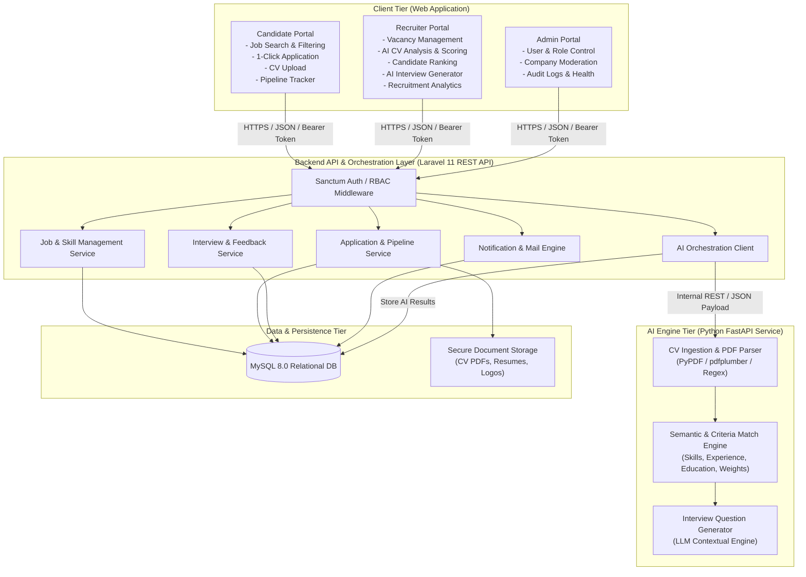
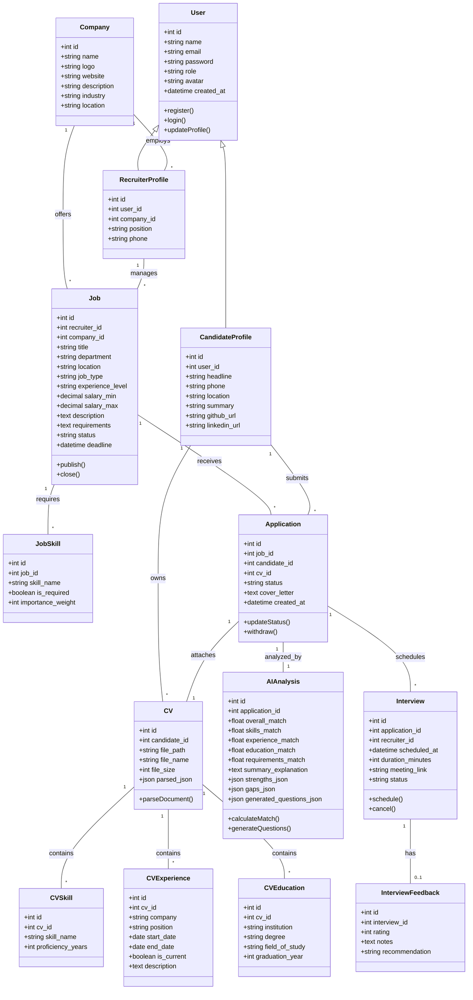
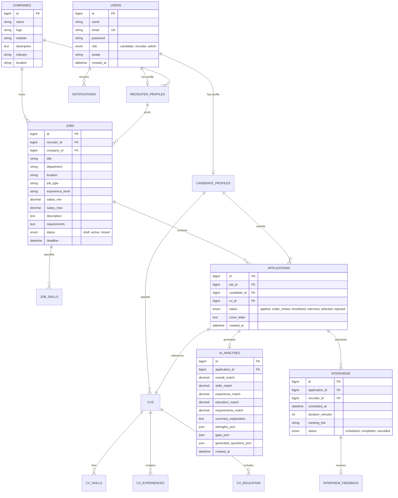
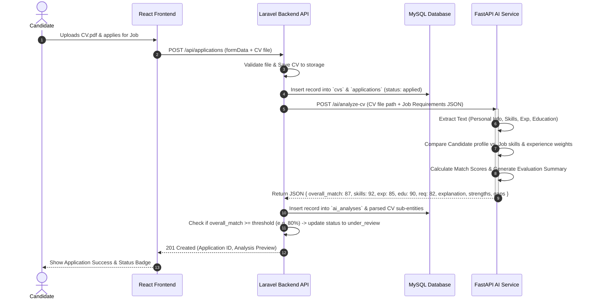
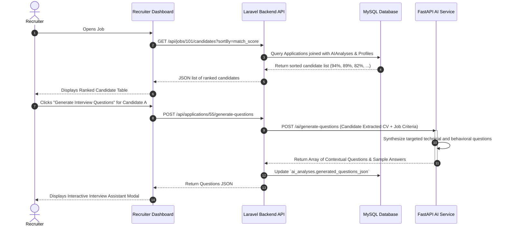
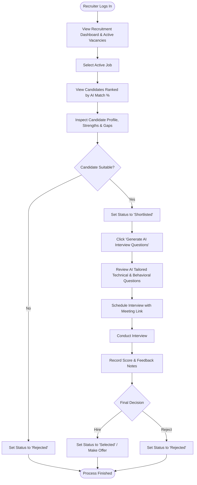

# Phase 2 — System Design Document
## HireAI: AI-Powered Recruitment and CV Analysis Platform

---

## 1. System Architecture Diagram



---

## 2. Use Case Diagrams

### 2.1 Overall System Use Case

```mermaid
graph LR
    Candidate((Candidate))
    Recruiter((Recruiter))
    Admin((Administrator))

    subgraph HireAISystem ["HireAI Platform"]
        UC1a[UC1a: Register & Login (Candidate / Recruiter Public Auth)]
        UC1b[UC1b: Provision Admin Account & Role Control (Admin Only)]
        UC2[Browse & Search Jobs]
        UC3[Upload CV & Apply]
        UC4[Track Application Pipeline]
        UC5[Create & Publish Job Vacancies]
        UC6[Define Required Skills & Experience]
        UC7[Review Candidate Applications]
        UC8[Trigger & View AI CV Match Analysis]
        UC9[Rank Applicants by Match Score]
        UC10[Generate AI Interview Questions]
        UC11[Schedule Interview & Record Feedback]
        UC12[View Analytics & Hiring Funnel]
        UC13[Manage Users, Roles & Companies]
        UC14[System Audit & Monitoring]
    end

    Candidate --> UC1a
    Candidate --> UC2
    Candidate --> UC3
    Candidate --> UC4

    Recruiter --> UC1a
    Recruiter --> UC5
    Recruiter --> UC6
    Recruiter --> UC7
    Recruiter --> UC8
    Recruiter --> UC9
    Recruiter --> UC10
    Recruiter --> UC11
    Recruiter --> UC12

    Admin --> UC1a
    Admin --> UC1b
    Admin --> UC13
    Admin --> UC14
```

---

## 3. Class Diagram



---

## 4. Entity-Relationship (ER) Diagram



---

## 5. Sequence Diagrams

### 5.1 CV Upload & AI Candidate Matching Flow



### 5.2 Recruiter Views Ranked Candidates & Generates AI Interview Questions



---

## 6. Activity Diagrams

### 6.1 Application Submission & AI Processing Pipeline

```mermaid
flowchart TD
    Start([Candidate Starts Application]) --> SelectJob[Select Job & Review Requirements]
    SelectJob --> UploadCV[Upload CV PDF & Fill Profile Info]
    UploadCV --> Submit[Submit Application]
    Submit --> StoreFile[Backend Stores CV File]
    StoreFile --> CreateAppRecord[Create Application in DB (Status: Applied)]
    CreateAppRecord --> TriggerAI[Send CV to FastAPI AI Engine]
    
    subgraph AI Engine Processing
        TriggerAI --> ExtractText[Extract Raw Text & Structure Data]
        ExtractText --> ParseEntities[Parse Skills, Experience, Education, Projects]
        ParseEntities --> CompareSkills[Compare Candidate Skills with Job Required Skills]
        CompareSkills --> CompareExp[Analyze Work Experience & Seniority Level]
        CompareExp --> ComputeScores[Calculate Match % & Weighted Scores]
        ComputeScores --> GenSummary[Generate Natural Language Fit Explanation]
    end

    GenSummary --> SaveAnalysis[Store Results in `ai_analyses` Table]
    SaveAnalysis --> ScoreCheck{Overall Match >= 70%?}
    ScoreCheck -- Yes --> SetReview[Update Status to 'Under Review']
    ScoreCheck -- No --> KeepApplied[Keep Status as 'Applied']
    SetReview --> NotifyRecruiter[Notify Recruiter of New High-Match Candidate]
    KeepApplied --> End([Workflow Complete])
    NotifyRecruiter --> End
```

### 6.2 Recruiter Hiring Workflow


