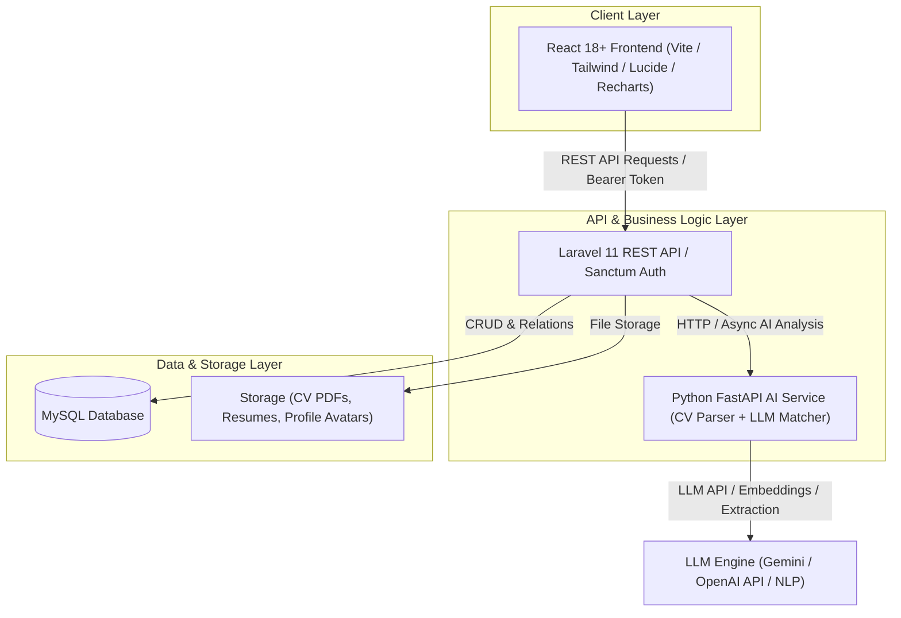
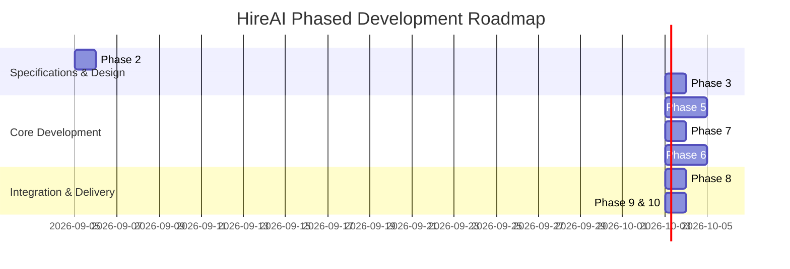

# Implementation Plan - HireAI: AI-Powered Recruitment & CV Analysis Platform

HireAI is an intelligent full-stack recruitment platform designed to automate and streamline the hiring workflow. It empowers Recruiters to publish vacancies, manage candidate pipelines, analyze CVs using AI (extracting skills, experience, match percentage with detailed breakdowns), rank applicants, and generate contextual interview questions. It allows Candidates to search jobs, submit applications with CV uploads, and track their application progress.

---

## Architecture Overview



---

## User Roles & Capabilities

| Role | Key Capabilities |
| :--- | :--- |
| **👤 Candidate** | Profile management, job search & filters, 1-click apply with PDF CV upload, real-time application status tracker, interview schedule view. |
| **👨‍💼 Recruiter** | Company profile, job vacancy posting with structured skill/exp criteria, AI CV extraction, candidate ranking table by match %, AI interview question generator, pipeline status management (`Applied` -> `Under Review` -> `Shortlisted` -> `Interview` -> `Selected/Rejected`), analytics dashboard. |
| **🛡️ Administrator** | Platform oversight, user & company moderation, job listing audit, system health & activity metrics. |

---

## Proposed System Design & Database Schema

### Database Tables (Phase 3)
1. `users` (id, name, email, password, role: candidate/recruiter/admin, avatar, created_at, ...)
2. `companies` (id, name, logo, website, description, industry, location, ...)
3. `recruiter_profiles` (id, user_id, company_id, position, phone, ...)
4. `candidate_profiles` (id, user_id, headline, phone, location, summary, github_url, linkedin_url, ...)
5. `jobs` (id, recruiter_id, company_id, title, department, location, job_type, experience_level, salary_min, salary_max, description, requirements, status: draft/active/closed, deadline, created_at)
6. `job_skills` (id, job_id, skill_name, is_required, importance_weight)
7. `applications` (id, job_id, candidate_id, cv_id, status: applied/under_review/shortlisted/interview/selected/rejected, cover_letter, created_at)
8. `cvs` (id, candidate_id, file_path, file_name, file_size, parsed_json, created_at)
9. `cv_skills` (id, cv_id, skill_name, proficiency_years)
10. `cv_experiences` (id, cv_id, company, position, start_date, end_date, is_current, description)
11. `cv_education` (id, cv_id, institution, degree, field_of_study, graduation_year)
12. `ai_analyses` (id, application_id, overall_match, skills_match, experience_match, education_match, requirements_match, summary_explanation, strengths_json, gaps_json, generated_questions_json, created_at)
13. `interviews` (id, application_id, recruiter_id, scheduled_at, duration_minutes, meeting_link, status: scheduled/completed/cancelled)
14. `interview_feedback` (id, interview_id, rating, notes, recommendation: hire/reject/next_round)
15. `notifications` (id, user_id, title, message, read_at, link)

---

## Proposed Project Structure

```
HireAI/
├── docs/                        # Phase 2: UML diagrams & design docs (Mermaid, Markdown)
├── backend/                     # Phase 5: Laravel REST API
│   ├── app/
│   │   ├── Http/Controllers/Api/ (AuthController, JobController, ApplicationController, AIController, etc.)
│   │   ├── Models/              (User, Job, Application, CV, AIAnalysis, Interview, etc.)
│   │   └── Services/            (AIServiceClient, CVParserService, etc.)
│   ├── database/migrations/
│   └── routes/api.php
├── ai-service/                  # Phase 7: Python FastAPI Service
│   ├── app/
│   │   ├── main.py
│   │   ├── extractor.py         (PDF text extraction, PyPDF / pdfplumber / regex / LLM prompt)
│   │   ├── matcher.py           (Job requirement matching, scoring calculation)
│   │   └── interview_gen.py     (Contextual question generator)
│   └── requirements.txt
└── frontend/                    # Phase 6: React + Tailwind + Vite SPA
    ├── src/
    │   ├── components/          (Navbar, Sidebar, StatsCards, MatchBadge, CandidateCard, Modal, etc.)
    │   ├── pages/
    │   │   ├── candidate/       (JobsPage, JobDetailsPage, ApplicationHistory, ProfilePage)
    │   │   ├── recruiter/       (Dashboard, JobManage, ApplicantReview, AIAnalysisView, InterviewScheduler)
    │   │   ├── admin/           (UserManagement, SystemMetrics)
    │   │   └── auth/            (Login, Register, RoleSelect)
    │   ├── services/api.js      (Axios API client)
    │   └── context/AuthContext.jsx
    └── package.json
```

---

## Implementation Roadmap



### Next Steps to Begin:
1. **Phase 2 & Phase 3 Deliverables**: Generate complete UML diagrams (Use Case, Class Diagram, ERD, Sequence & Activity Diagrams) and detailed database migration designs in `docs/`.
2. **Project Setup & Scaffolding**: Setup the repository structure with the Frontend, Backend, and AI Service templates.

---

## Verification Plan

### Automated & Manual Verification
- Verify database schemas and relationships with automated model/migration tests.
- Verify FastAPI CV extraction endpoint with sample CV PDFs (`.pdf` files).
- Verify AI scoring algorithm and question generator with varied candidate CVs and job criteria.
- Verify End-to-End browser workflows (Candidate applying with CV -> Recruiter viewing AI match breakdown & generated questions -> Status updates -> Analytics dashboard).
